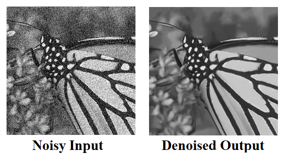
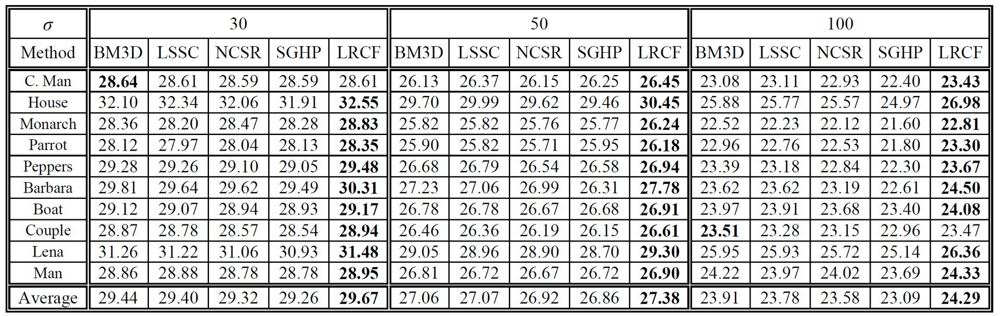

# Low-Rank Regularized Collaborative Filtering (LRCF)

Implementation of the **Low-Rank Regularized Collaborative Filtering** (LRCF) algorithm for natural image denoising.

<p align="center">
  
</p>


## 📄 Overview

This repository provides MATLAB demo code for the LRCF algorithm, as described in the following publication:

> **M. Nejati, S. Samavi, S.M.R. Soroushmehr, and K. Najarian**,  
> *Low-Rank Regularized Collaborative Filtering for Image Denoising*,  
> IEEE International Conference on Image Processing (ICIP), Quebec City, Canada, Sept. 2015, pp. 730–734.
>
>  [](https://doi.org/10.1109/ICIP.2015.7350895)

If you use this code in your research, **please cite the above paper**.


## 💡 Core Idea

The **Low-Rank Regularized Collaborative Filtering (LRCF)** framework denoises natural images by leveraging the structural redundancy of small, similar patches.  
Groups of similar patches are modeled as low-rank matrices, and noise is suppressed through **optimal singular value shrinkage**, a theoretically grounded operator that efficiently recovers the underlying low-rank structure from noisy data.  


## 🛠 Requirements & Compatibility

- **MATLAB Versions Tested:**
  - MATLAB R2012b (Windows 7, 64-bit)
  - MATLAB R2023b (Windows 10, 64-bit)  
- Other versions of MATLAB may work but have not been tested.


## 🚀 Getting Started

1. Clone or download this repository.  
2. Open MATLAB and set the project folder as the working directory.  
3. Run the provided demo scripts to reproduce the denoising results.


## 📊 Results

<p align="center">
  
</p>


## ⚠ Disclaimer

- This software is provided **for non-commercial research purposes only**.  
- Use at your own risk — **no warranty** is implied or provided.


## 🙏 Acknowledgment

Thank you for your interest in our work!  
We hope this code is useful for your research in image denoising and related applications.


## 📚 Citation

If you use this code in your research, please cite:

```bibtex
@inproceedings{nejati2015lrcf,
  author    = {Mansour Nejati and Shadrokh Samavi and S. M. Reza Soroushmehr and Kayvan Najarian},
  title     = {Low-Rank Regularized Collaborative Filtering for Image Denoising},
  booktitle = {2015 IEEE International Conference on Image Processing (ICIP)},
  pages     = {730--734},
  year      = {2015},
  doi       = {10.1109/ICIP.2015.7350895}
}
